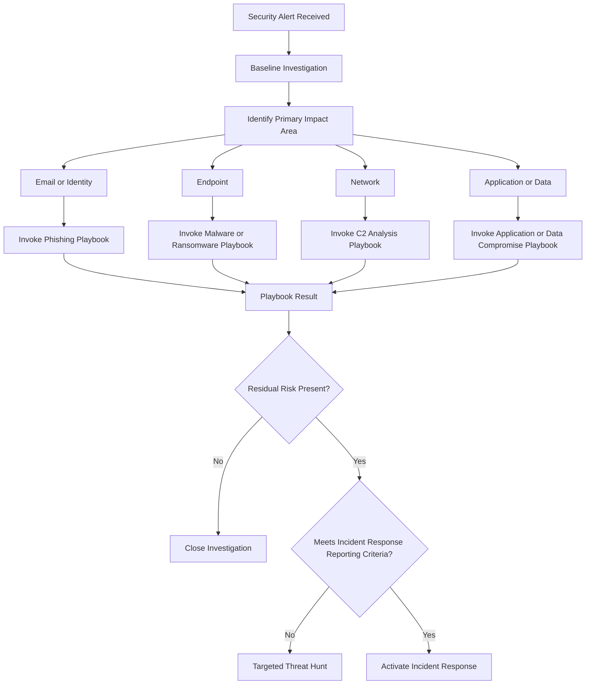

# Baseline SOC Investigation Flow

## Purpose
Provide a consistent, repeatable investigation framework for **all security alerts**.
The baseline determines **what happens next**, while individual playbooks perform
deep analysis for specific threat types.

This flow ensures:
- Consistent analyst behavior
- Clear separation of analysis vs response
- Audit-defensible decisions
- Scalable playbook integration

## What the Baseline Does
- Receives all security alerts
- Performs initial triage and validation
- Identifies the primary impact area
- Routes analysis to the correct playbook
- Makes the **final response decision**

## What the Baseline Does NOT Do
- Deep technical analysis
- Threat-specific investigation
- IOC tuning or blocking decisions
- Declare incidents prematurely

Those actions occur **inside playbooks**.

## Baseline Investigation Flow
Playbooks identify risk. The baseline decides response.

---
*Author: Michael Baker*  
*Maintained as part of the SecOps Playbooks repository*
(Last updated: 12/2025)
