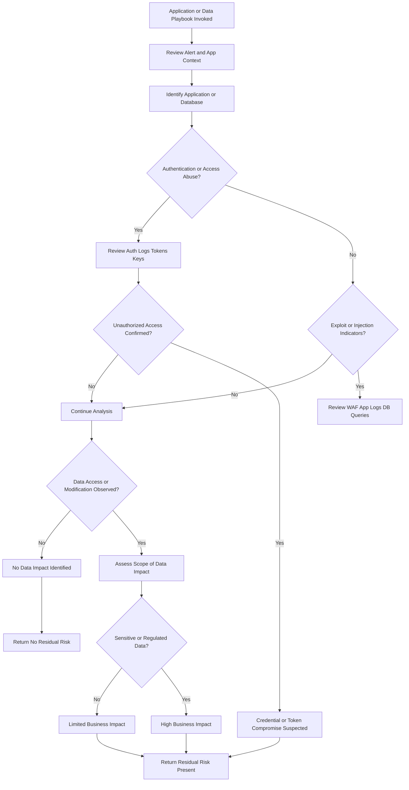

# Application / Data Compromise Playbook

## Purpose
Determine whether application or database alerts
represent unauthorized access or data impact.

## When This Playbook Is Used
- WAF alerts
- Application authentication abuse
- API misuse
- Database access anomalies

## Analysis Flow

---
*Author: Michael Baker*  
*Maintained as part of the SecOps Playbooks repository*
(Last updated: 12/2025)