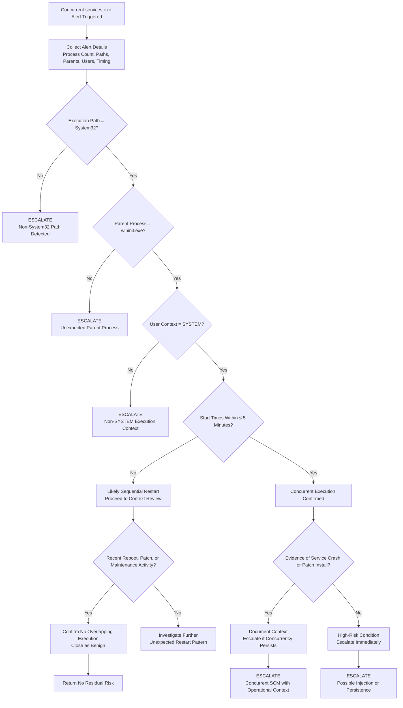

# Concurrent services.exe Playbook
## Purpose
Analyze alerts indicating concurrent execution of services.exe to determine whether the behavior represents:
* Legitimate restart or maintenance activity, or
* System instability, corruption, or potential malicious abuse of a core Windows process

## When This Playbook Is Used
* Defender XDR alert: Concurrent services.exe execution detected
* Advanced hunting results showing multiple services.exe instances
* Suspicious system integrity or persistence investigations

## Analysis Flow

## What Analysts Must Validate

### Expected Legitimate State

* Path: C:\Windows\System32\services.exe
* Parent process: wininit.exe
* User: NT AUTHORITY\SYSTEM
* One active Services.exe instance at a time.

### Indicators Requiring Escalation
* Non-System32 execution path
* Unexpected parent process
* Non-SYSTEM execution context
* Overlapping services.exe instances found
* Repeated concurrent execution after patching or reboot

### Common Benign Scenarios
* Sequential service restarts


### High-Risk Scenarios
* Concurrent Services.exe's persisting beyond patch window
* Concurrent Services.exe's combined with suspicious child processes
* Concurrent Services.exe's on high-value servers (DCs, app servers)

## KQL Advanced Hunting Query
```kql
DeviceProcessEvents
| where DeviceName == "<DeviceName>"
| where FileName == "services.exe"
| project
    Timestamp,
    ProcessId,
    ProcessCreationTime,
    FolderPath,
    InitiatingProcessFileName,
    AccountName
| order by ProcessCreationTime asc
```

---
*Author: Michael Baker*  
*Maintained as part of the SecOps Playbooks repository*
(Last updated: 01/2026)
