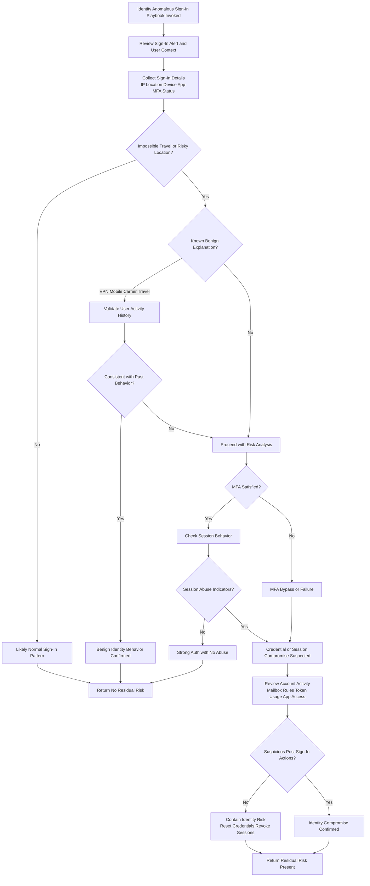

# Identity Anomalous Sign-In Playbook

## Purpose
Determine whether high-risk or anomalous sign-ins represent
benign user behavior or credential/session compromise.

## When This Playbook Is Used
- High-risk sign-in alerts
- Impossible or unrealistic travel alerts
- Unfamiliar sign-in properties
- Identity protection alerts

## Analysis Flow

---
*Author: Michael Baker*  
*Maintained as part of the SecOps Playbooks repository*
(Last updated: 12/2025)
