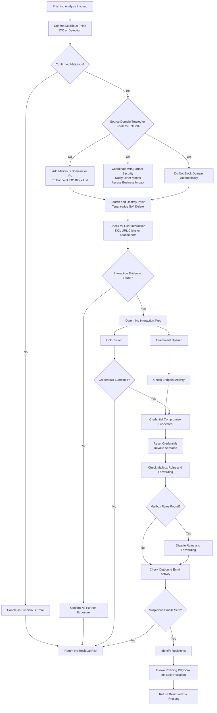

# Phishing Playbook

## Purpose
Analyze phishing events to determine whether user interaction,
credential compromise, or lateral phishing occurred.

## When This Playbook Is Used
- Phishing alerts
- User-reported emails
- Identity alerts tied to email activity

## Analysis Flow

---
*Author: Michael Baker*  
*Maintained as part of the SecOps Playbooks repository*
(Last updated: 12/2025)

