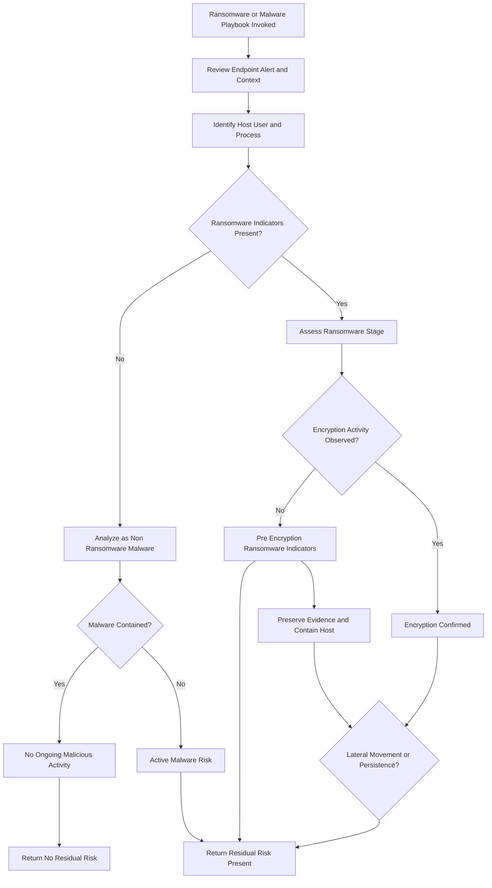

# 🧨 Ransomware / Malware Playbook (`playbooks/ransomware-malware/README.md`)

# Ransomware / Malware Playbook

## Purpose
Distinguish ransomware, pre-encryption activity,
and non-ransomware malware, and assess residual risk.

## When This Playbook Is Used
- Malware alerts
- Ransomware detections
- Suspicious endpoint activity

## Analysis Flow

---
*Author: Michael Baker*  
*Maintained as part of the SecOps Playbooks repository*
(Last updated: 12/2025)
