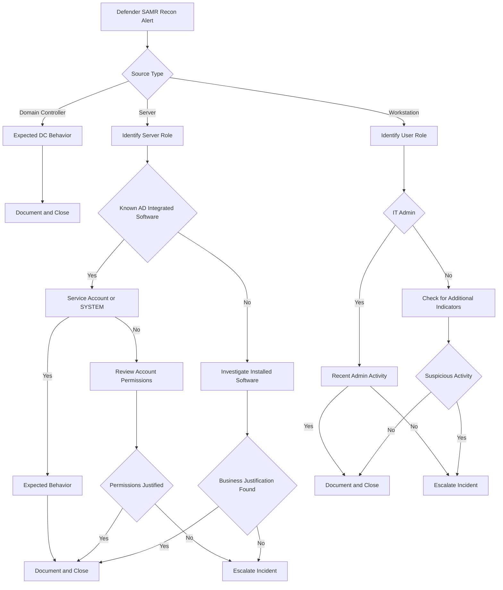

# Reconnaissance & Enumeration Alert Playbook  
**Microsoft Defender – SAMR, Account Enumeration, Identity Discovery**

## Purpose

This playbook defines a **repeatable investigation and process-of-elimination workflow** for Microsoft Defender alerts related to **identity, account, and directory reconnaissance** activity.

These alerts commonly indicate **early-stage discovery behavior**, but in enterprise environments they are frequently triggered by **legitimate systems and administrative activity**.

This playbook ensures:
- Consistent SOC investigations
- Reduced false-positive escalations
- Clear audit and management justification
- Escalation only when follow-on malicious behavior is observed

## Alerts Covered

This playbook applies to the following Microsoft Defender alert types (and similar):

- User and group membership reconnaissance (SAMR)
- Account enumeration detected
- Sensitive group discovery
- Directory service enumeration
- Suspicious RPC / LDAP / SMB discovery
- NTLM or legacy authentication reconnaissance
- Identity discovery without exploitation
- Entra ID / Azure AD directory enumeration alerts

## Investigation Philosophy

> **Reconnaissance without exploitation is not an incident.**

Discovery activity alone does not indicate compromise.  
Escalation occurs **only when reconnaissance is paired with additional malicious indicators**.

## Investigation Flow

---
*Author: Michael Baker*  
*Maintained as part of the SecOps Playbooks repository*
(Last updated: 1/2026)
