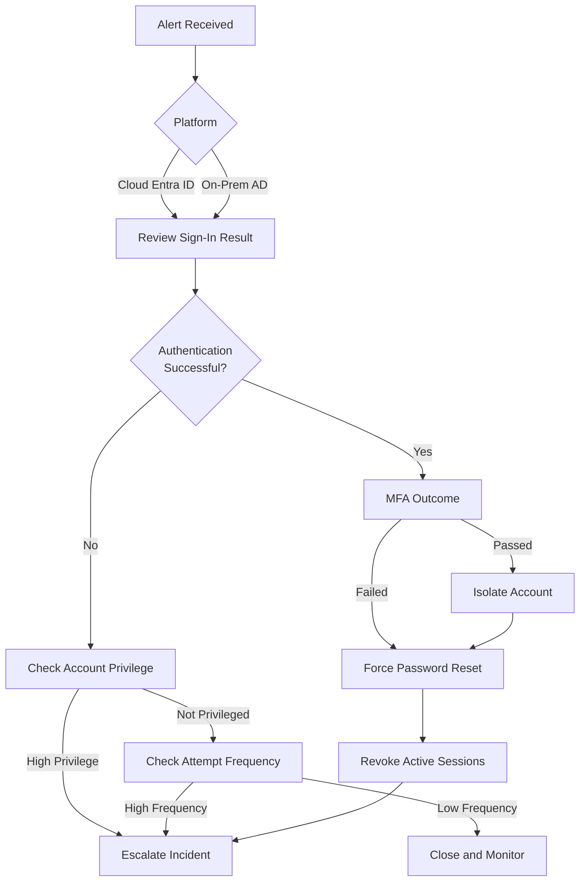

# Suspicious Login Attempts Playbook  
**Microsoft Defender – Cloud (Entra ID) & On-Prem Authentication**

## Purpose

This playbook defines a **repeatable, risk-based investigation process** for suspicious login alerts affecting:

- Cloud identities (Microsoft Entra ID)
- On-prem Active Directory user accounts
- On-prem service accounts

Authentication attempts are evaluated using **frequency, context, controls, and privilege level**, not alert presence alone.

## Alerts Covered

This playbook applies to:

- Suspicious sign-in activity
- Unfamiliar Sign-In Properties
- Unusual authentication patterns
- Risky sign-ins (Entra ID)
- Excessive login failures
- Impossible/Atypical Travel
- Legacy authentication usage
- On-prem suspicious logon attempts

## Investigation Philosophy

> **Authentication attempts are common. Compromise is not.**

- Failed attempts ≠ incident  
- Control enforcement (geo-block, CA) = **success**, not failure  
- Escalation requires **signal**, not just noise  

## Investigation Flow – Cloud and On-Prem

### Unfamiliar Sign-in Attempts Flow

---
*Author: Michael Baker*  
*Maintained as part of the SecOps Playbooks repository*
(Last updated: 1/2026)