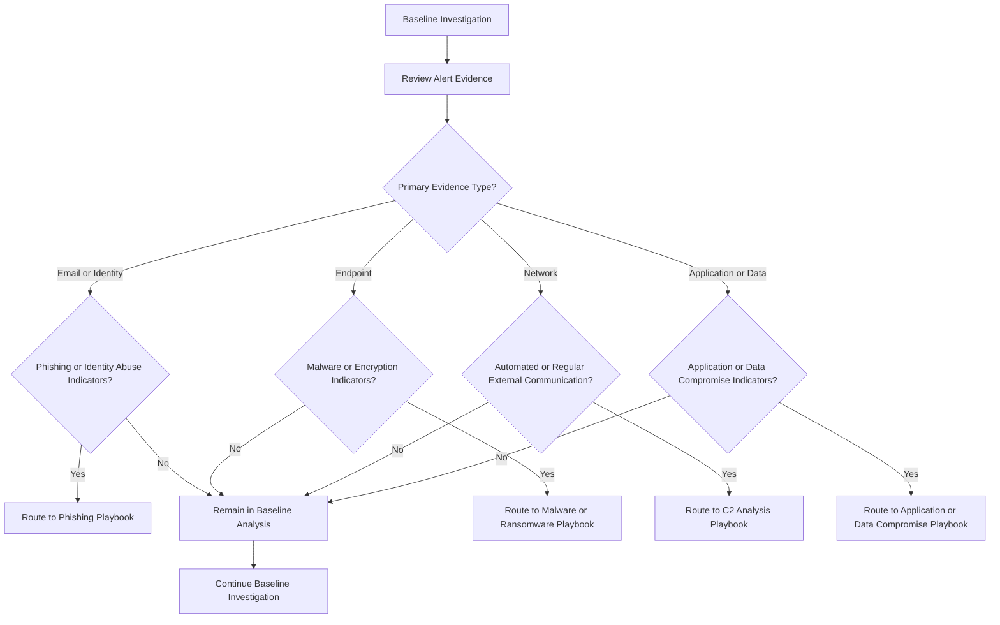

# Playbook Routing Logic

## Purpose
Define a consistent, evidence-based method for routing security alerts
from the **Baseline SOC Investigation Flow** to the appropriate **analysis playbook**.

Routing ensures:
- Alerts are analyzed by the correct playbook
- Analysts follow consistent decision logic
- Playbooks are invoked based on evidence, not alert names
- The baseline remains threat-agnostic

## What Routing Does
- Evaluates **primary evidence** from an alert
- Identifies the dominant **impact area**
- Directs analysis to the appropriate playbook

## What Routing Does NOT Do
- Perform deep analysis
- Decide response actions
- Declare incidents
- Close alerts

Routing only answers:
> **“Which playbook should analyze this?”**

Routing only answers:
*“Which playbook should analyze this?”**

## Routing Flow

---
*Author: Michael Baker*  
*Maintained as part of the SecOps Playbooks repository*
(Last updated: 12/2025)
